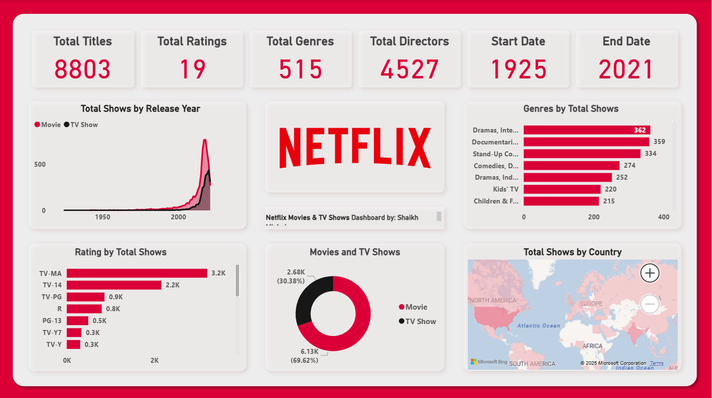

# 📊 Netflix Data Analysis Dashboard – Power BI

This project presents an interactive Power BI dashboard built on Netflix viewing data. It provides insights into content trends, release patterns, ratings distribution, and much more through a user-friendly visual experience.

## 🔧 Tools & Technologies Used
- **Power BI**
- **Power Query**
- **DAX (Data Analysis Expressions)**
- **Data Cleaning & Transformation**

## 📌 Features
- Breakdown of content by **type, genre, country, and release year**
- Insights on **content added over time**
- **Ratings distribution** for TV shows and movies
- Trend analysis on **popular directors and actors**
- Interactive filters for deep data exploration

## 📂 Dataset
You can find the dataset used for this analysis [here](https://www.kaggle.com/datasets/shivamb/netflix-shows).

## 🖼️ Dashboard Preview

## 🚀 How to Use
1. Open the `.pbix` file in Power BI Desktop.
2. Refresh the data (if needed) or modify queries in **Power Query Editor**.
3. Interact with filters, visuals, and slicers to explore the insights.

## 📚 What I Learned
- Data shaping using Power Query Editor
- Building relationships and data models
- Designing intuitive dashboards with user-centered insights
- Writing DAX measures and calculated columns for analysis
